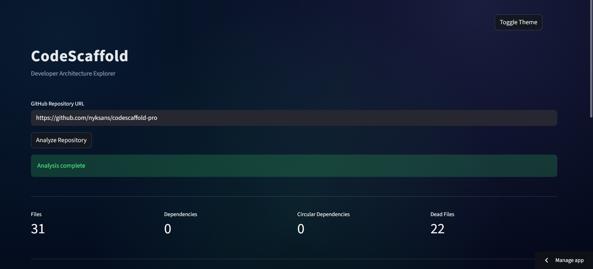
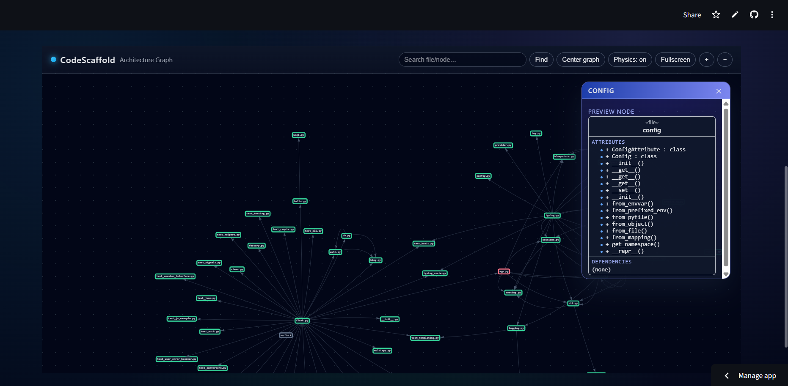
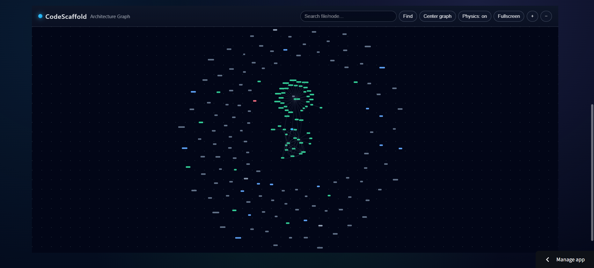

# CodeScaffold Pro


**CodeScaffold Pro** is a developer tool that **analyzes and visualizes software repositories** using an interactive **graph-based architecture viewer** built with **Python and Streamlit**.

It helps developers quickly **understand complex codebases** by converting repository structures into **interactive architecture graphs**.

---

# Features

* **Repository Structure Analysis**
  Automatically parses project folders and files.

* **Interactive Architecture Graph**
  Visualizes modules and relationships using dynamic graphs.

* **Layer-based Architecture View**
  Organizes components into logical layers:

  * Frontend
  * Backend
  * Database
  * Services
  * Utilities

* **Interactive Node Exploration**
  Click nodes to explore dependencies and relationships.

* **Scalable Visualization**
  Designed to handle large repositories.

* **Streamlit Web Interface**
  Clean and lightweight interface for easy interaction.

---

# Architecture

```
Repository
   │
   ▼
Repository Parser
   │
   ▼
Graph Builder
   │
   ▼
Visualization Engine
   │
   ▼
Streamlit Interface
```

**Core Components**

| Module               | Description                             |
| -------------------- | --------------------------------------- |
| Repository Parser    | Extracts structure from the repository  |
| Graph Builder        | Converts structure into nodes and edges |
| Visualization Engine | Generates interactive graph layouts     |
| Streamlit UI         | Provides the web dashboard              |

---

# Installation

Clone the repository:

```bash
git clone https://github.com/yourusername/codescaffold-pro.git
cd codescaffold-pro
```

Install dependencies:

```bash
pip install -r requirements.txt
```

---

# Running the Application

Start the Streamlit app:

```bash
streamlit run app.py
```

The application will launch in your browser.

---

# Deployment

### Streamlit Community Cloud

1. Push project to GitHub
2. Go to [https://share.streamlit.io](https://share.streamlit.io)
3. Select repository
4. Set **Main File Path** → `app.py`
5. Deploy

---

# Use Cases

* Understanding unfamiliar repositories
* Developer onboarding
* Architecture visualization
* Codebase documentation
* Hackathon tools
* Educational demonstrations

---

# Future Roadmap

* AI-powered code analysis
* Dependency impact visualization
* Architecture change tracking
* Multi-repository comparisons
* Exportable architecture diagrams

---

# Contributing

Contributions are welcome.

1. Fork the repository
2. Create a new branch
3. Submit a pull request

---

## UI Preview






